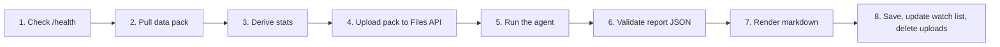

# Blockford Daily Review

A read-only script that runs once a day. It pulls the last day of data from the Blockford app's API, computes the day's statistics in code, and has a Claude agent write a daily review: what changed, what to watch, and what the agent found that the UI does not show.

The review is for Jason's own reading. It is also the first step toward agents that understand the on-chain landscape before they act.

**Status:** scaffold. Milestone 0 is done (2026-10-07): the package, settings, CLI stubs and `make` targets are in place, and the commands parse but do nothing yet. Pass 1a in [docs/BUILD-PLAN.md](docs/BUILD-PLAN.md) is next. Open questions are in [docs/OPEN-QUESTIONS.md](docs/OPEN-QUESTIONS.md).

## How one run works



If `/health` cannot be reached the run stops with a clear error and writes no report. Every other failure is recorded, never hidden. See [docs/ARCHITECTURE.md](docs/ARCHITECTURE.md) for the full picture.

## Rules that never bend

- Read-only. GET requests only. The two POST routes are never called.
- Claude never touches the network. The script makes every API call.
- Model-written code runs in Anthropic's sandbox, never on this machine.
- The agent describes what readings mean. It never recommends a trade, a position, or yield.
- Thresholds come from the API. None are hard-coded.
- A null is an absence, not a zero.

The full list lives in [docs/DECISIONS.md](docs/DECISIONS.md).

## Documents

| Document | What it holds |
|---|---|
| [docs/BUILD-SPEC.md](docs/BUILD-SPEC.md) | The source spec. Requirements originate here. |
| [docs/PRD.md](docs/PRD.md) | Problem, users, goals, numbered requirements, success criteria. |
| [docs/ARCHITECTURE.md](docs/ARCHITECTURE.md) | Components, data flow, the agent loop, trust boundaries, failure handling. |
| [docs/AGENT-DESIGN.md](docs/AGENT-DESIGN.md) | What the agent receives, its tools, its rules, prompt caching layout. |
| [docs/DATA-CONTRACTS.md](docs/DATA-CONTRACTS.md) | Shapes of the data pack, `derived.json`, the report schema, the watch list. |
| [docs/BUILD-PLAN.md](docs/BUILD-PLAN.md) | Seven milestones from the spec, split into passes, each with tasks, tests, and a done-when line. |
| [docs/TESTING.md](docs/TESTING.md) | Test strategy, fixtures, required cases. |
| [docs/RUNBOOK.md](docs/RUNBOOK.md) | How to run it locally, exit codes, troubleshooting. |
| [docs/DECISIONS.md](docs/DECISIONS.md) | Decision log. Accepted decisions from the spec plus proposed technical ones. |
| [docs/OPEN-QUESTIONS.md](docs/OPEN-QUESTIONS.md) | Questions that need Jason's ruling before or during the build. |
| [docs/GLOSSARY.md](docs/GLOSSARY.md) | Domain terms used across the documents. |
| [docs/ENGINEERING-PRINCIPLES.md](docs/ENGINEERING-PRINCIPLES.md) | The engineering principles every change is held to. |
| [CLAUDE.md](CLAUDE.md) | Working rules for Claude Code in this repo. |

## Quickstart

Python 3.11 or later, ruled on 2026-10-07 (question 1 in [docs/OPEN-QUESTIONS.md](docs/OPEN-QUESTIONS.md)).

```bash
cp .env.example .env     # then fill in ANTHROPIC_API_KEY
make setup               # uv sync
make check               # lint, then tests: the gate before every commit
make pull                # save today's data pack, no agent
make run                 # full run: pull, derive, agent, render, save
make render DATE=YYYY-MM-DD   # re-render markdown from a saved report
make help                # list every target
```

Each target is one line over `uv`; the underlying commands are in [docs/RUNBOOK.md](docs/RUNBOOK.md) section 3. To reuse a saved pack after a failed run: `uv run daily-review run --date YYYY-MM-DD`.

The API is reached through the SSM port-forward described in the app's RUNBOOK section 2b. Details and troubleshooting are in [docs/RUNBOOK.md](docs/RUNBOOK.md).

## Layout

```
liquidity_read_agent/
  README.md
  CLAUDE.md
  Makefile              # setup, test, lint, check, run, pull, render, help
  pyproject.toml        # package, dependencies, the daily-review command, ruff and pytest
  uv.lock               # pinned versions; committed
  .env.example
  docs/                 # all project documents
  src/daily_review/     # the package (see docs/ARCHITECTURE.md)
  prompts/system.md     # the agent's system prompt
  vendor/API-SPEC.md    # copied from the app repo, with its date
  tests/
  data/                 # gitignored: raw data packs by date
  reports/              # gitignored: YYYY-MM-DD.json and .md
  state/                # gitignored: watchlist.json
```

`data/`, `reports/` and `state/` stay out of git. They hold depth figures.

## Later, not v1

Daily runs inside the VPC, the key in Secrets Manager, email through SES, an S3 archive. See spec section 12.
