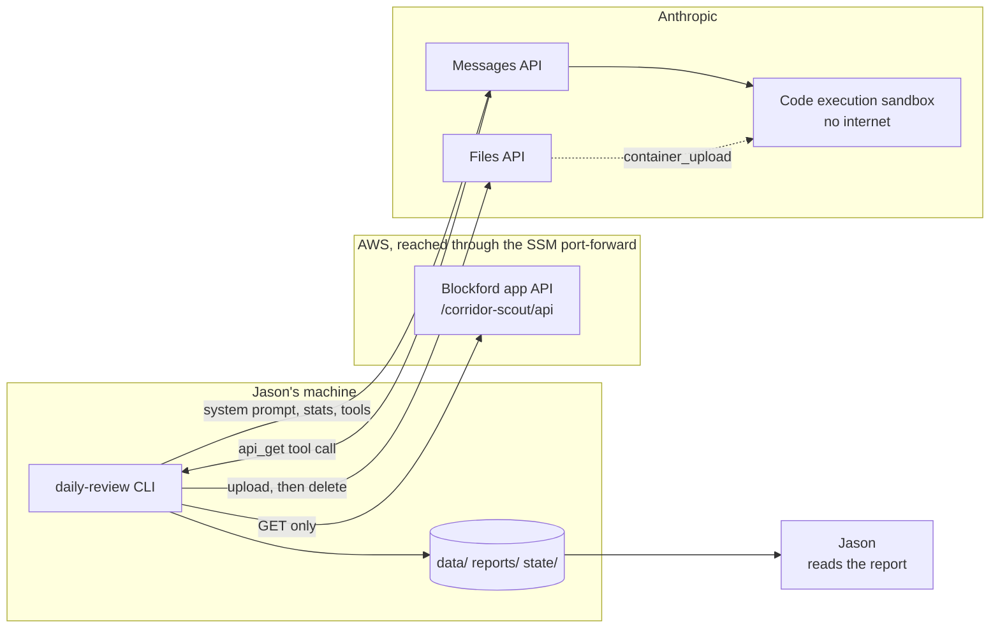
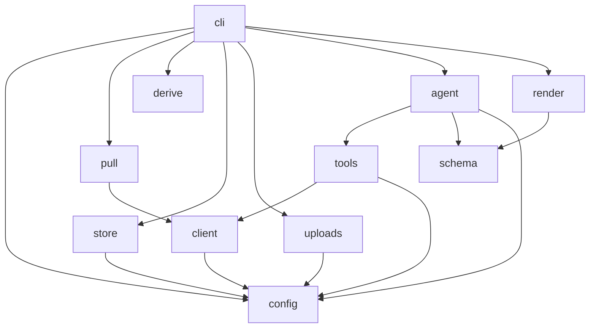
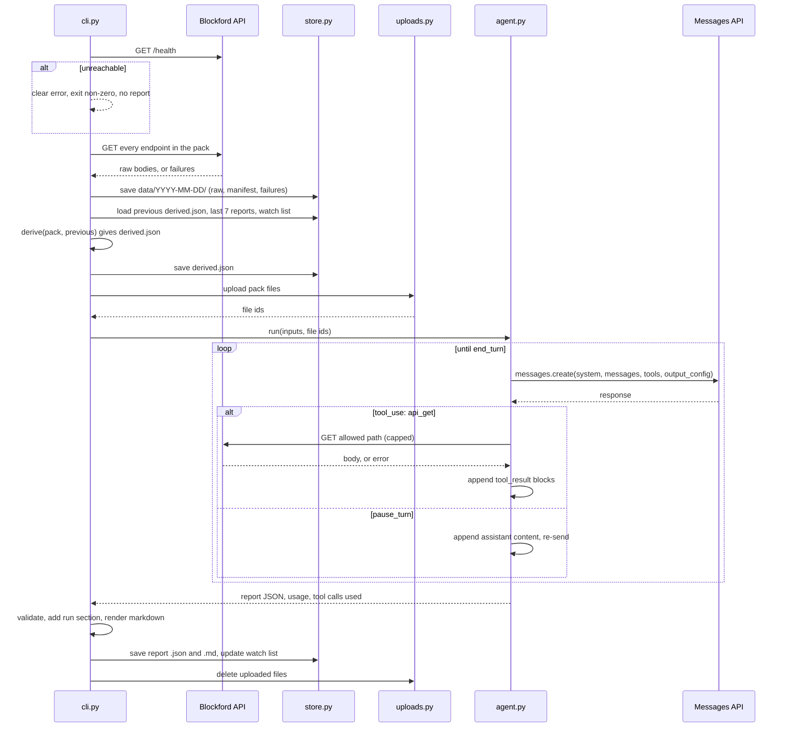
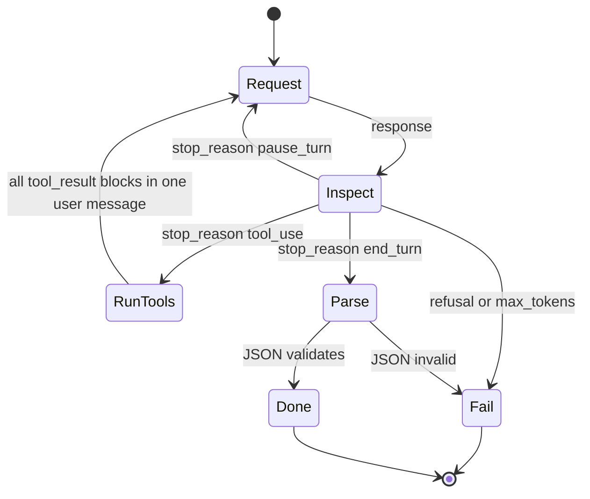
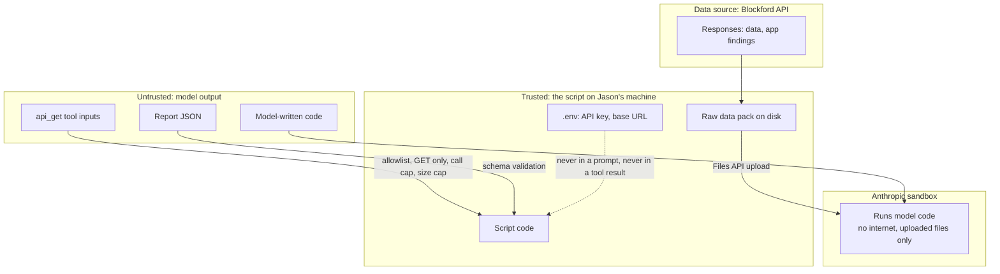
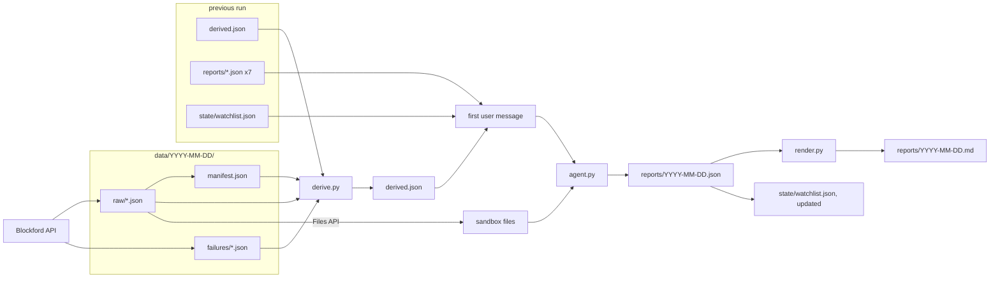
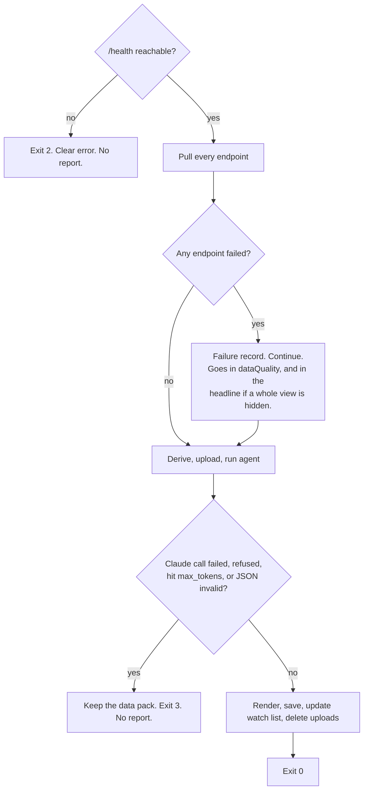

# Architecture — Blockford Daily Review

**Version:** 0.1 (2026-10-07)
**Status:** draft. Becomes the contract as each build step ships. The module layout was ruled on 2026-10-07 (T-05 in [DECISIONS.md](DECISIONS.md)).

This document says what the pieces are, what each one owns, how a run moves through them, and where trust ends. Shapes of the data live in [DATA-CONTRACTS.md](DATA-CONTRACTS.md). The agent's prompt and tools live in [AGENT-DESIGN.md](AGENT-DESIGN.md).

## 1. System context



Three parties. The script on Jason's machine is the only thing that talks to the Blockford API. Claude talks to the script through tool calls and to the sandbox through the code execution tool. The sandbox sees only the files the script uploaded.

## 2. Principles applied

From [ENGINEERING-PRINCIPLES.md](ENGINEERING-PRINCIPLES.md): maximize cohesion, minimize coupling, contain the impact of change.

- **One module, one reason to change.** The API changes: `pull.py` and `tools.py`. The stats change: `derive.py`. The report shape changes: `schema.py` and `render.py`. The model or loop changes: `agent.py`. The layout on disk changes: `store.py`.
- **Pure where it can be.** `derive.py`, `schema.py`, and `render.py` take values and return values. No I/O. They are the easiest to test and the most likely to change.
- **I/O at the edges.** `client.py` (HTTP GET), `store.py` (filesystem), `uploads.py` (Files API), and the Messages API calls inside `agent.py`. Each is replaced by a fake in tests.
- **Dependencies are passed in.** `cli.py` builds everything and hands it down. No module reaches for global state. No module reads the environment except `config.py`.
- **The orchestrator holds no logic.** `cli.py` sequences the steps and maps failures to exit codes. Nothing else.

## 3. Components

| Module | Single responsibility | Depends on | I/O |
|---|---|---|---|
| `cli.py` | Parse the command, wire the modules, run the eight steps in order (or from a saved pack with `--date`), map outcomes to exit codes. | all below | none of its own |
| `config.py` | Load and validate settings from the environment into one typed `Settings` value. | — | env, `.env` |
| `client.py` | One HTTP GET function against the base URL with a timeout. Returns status, headers, body, or an error. It has no POST method. | `config` | HTTP |
| `pull.py` | The endpoint catalogue (spec section 5) and the pull: call each endpoint through `client`, keep the raw body, build the failure records and the manifest flags (truncated, coverage, total versus rows). Returns a `DataPack`. | `client` | none |
| `derive.py` | Compute `Derived` from a `DataPack` and the previous `Derived` (or none, on the first run). One function per statistic in spec section 6. | — | none |
| `store.py` | Paths by date. Save and load the data pack, `derived.json`, reports, and the watch list. List the last N reports. | `config` | filesystem |
| `uploads.py` | Upload the data pack files to the Files API, return their ids, delete them at the end. | `config` | Files API |
| `tools.py` | The `api_get` tool: its JSON schema, the allowlist built from the API spec, the call cap, the result size cap, and the function that executes one call through `client`. | `client`, `config` | HTTP (through `client`) |
| `agent.py` | The loop: build the system prompt and the first message, call the Messages API, dispatch tool calls, handle every stop reason, collect usage, return the parsed report and run facts. | `tools`, `schema`, `config` | Messages API |
| `schema.py` | The report JSON schema (agent part and full report), validation, and the limit checks. | — | none |
| `render.py` | Report JSON to markdown. | `schema` | none |

Files outside the package:

| File | Role |
|---|---|
| `prompts/system.md` | The static part of the system prompt. Loaded by `agent.py`. |
| `vendor/API-SPEC.md` | Copied from the app repo, with its date in the header. Appended to the system prompt in full. Also the source for the allowlist. |

### Dependency graph



Arrows point from the module that imports to the module it imports. No cycles. `derive`, `schema`, and `render` import nothing from the package except each other where shown.

## 4. One run, in sequence



Step numbers match spec section 4. The health check is the only step that stops the run before anything is written. On success it logs the body's `status`, `corridorsMonitored` and `updatedAt`, the only trace of which deployment answered (T-19). With `run --date`, the pull is skipped and the saved pack for that date is loaded instead (T-20).

## 5. The agent loop

The loop in `agent.py` is a manual loop, not the SDK tool runner. The runner does not resume `pause_turn` in Python, and the spec requires that case to be handled. Full prompt and tool detail is in [AGENT-DESIGN.md](AGENT-DESIGN.md).



Loop contract:

1. **Messages are append-only.** The assistant's full `content` (including `thinking`, `server_tool_use`, and code execution result blocks) is appended unchanged. Nothing earlier is edited. Thinking blocks are passed back as received.
2. **`tool_use`:** every `api_get` block in the response is executed, and all results go back in one user message as `tool_result` blocks. A failed call returns `tool_result` with `is_error: true` and the error in plain words.
3. **`pause_turn`:** the server-side tool loop (code execution) hit its iteration limit. Append the assistant content and send again. Add no new user text.
4. **Mixed turns:** when a response holds both a code execution result and an `api_get` call, the code result is already in the assistant content. Only the `api_get` call needs a `tool_result`. The next response continues from there.
5. **Call cap:** when `MAX_TOOL_CALLS` is reached, `api_get` returns an error result that says the cap was reached. The agent is told, not cut off. The report records the count.
6. **`end_turn`:** the first `text` block is the report JSON. Structured outputs guarantee it parses. `schema.py` validates it anyway.
7. **`refusal` or `max_tokens`:** the run fails loudly (spec section 11). The data pack stays on disk. Exit non-zero. No report.
8. **Usage** is summed across every request: input, output, cache read, cache write. It goes in the `run` section.

## 6. Claude API usage

Shapes checked against the Anthropic SDK reference on 2026-10-07. Do not write these from memory; check [AGENT-DESIGN.md](AGENT-DESIGN.md) or the SDK.

| Concern | Choice |
|---|---|
| SDK | Official `anthropic` Python SDK, 1.x. |
| Model | `MODEL` setting. Default `claude-sonnet-5-5`. Compare with `claude-opus-5-5`. |
| Request | `client.messages.create`, non-streaming, `max_tokens = MAX_OUTPUT_TOKENS` (default 16000). |
| Thinking | Left at the model default (adaptive, always on for both models). No `thinking` parameter is sent; `disabled` is rejected by both models. No `EFFORT` setting in v1 (T-13). |
| Tool choice | `auto` only. Forced tool choice is not supported on these models and is not needed. |
| Structured output | `output_config.format` with `type: json_schema` and the agent schema from `schema.py`. Works alongside tools. |
| Custom tool | `api_get`, `strict: true`, schema with `additionalProperties: false`. |
| Server tool | `{"type": "code_execution_20260521", "name": "code_execution"}`. Satisfies the spec's "20250825 or later". No beta header. |
| Files | `client.files.upload(file=Path(...))` per data pack file; `container_upload` blocks with the file ids in the first user message; `client.files.delete(id)` at the end of the run. No beta header. |
| Caching | `cache_control: {"type": "ephemeral"}` on the last system block. Tools render before system, so the tool list and the whole system prompt are cached together. Minimum cacheable prefix on these models is 512 tokens; the API spec alone exceeds that. Verify with `usage.cache_read_input_tokens` and record it. |
| Cache hygiene | Nothing volatile in `tools` or `system`: no dates, no run ids, no conditional sections. Dates and `derived.json` go in the user message. JSON is serialized with sorted keys. |
| Stop reasons | `end_turn`, `tool_use`, `pause_turn`, `max_tokens`, `refusal`. Each handled as in section 5. |
| Result blocks | `text`, `thinking`, `tool_use` (api_get), `server_tool_use`, `bash_code_execution_tool_result`, `text_editor_code_execution_tool_result`. Read by `type`. |

## 7. Trust boundaries



- Everything the model produces is untrusted input to the script. Tool inputs are checked against the allowlist and caps. The report is validated against the schema. Model-written code never runs here.
- The API key and the base URL never appear in the system prompt, the message, or a tool result.
- The API's own `finding` text is data, not instruction. The system prompt says so.
- The sandbox retains uploaded data for up to 30 days. Accepted for v1 (decision 6, internal use).

## 8. Data flow



The raw files are the only input to the sandbox. The message carries summaries only. The markdown is derived from the JSON and nothing else.

## 9. Persistence and layout

```
src/daily_review/
  cli.py  config.py  client.py  pull.py  derive.py  store.py
  uploads.py  tools.py  agent.py  schema.py  render.py
prompts/system.md
vendor/API-SPEC.md
tests/
  fixtures/            # response samples taken from API-SPEC.md
data/YYYY-MM-DD/       # gitignored
  raw/<name>.json      # verbatim body per endpoint
  failures/<name>.json # failure record per failed endpoint
  manifest.json        # one row per call: status, bytes, flags
  derived.json
reports/YYYY-MM-DD.json  reports/YYYY-MM-DD.md   # gitignored
state/watchlist.json                              # gitignored
```

Exact shapes: [DATA-CONTRACTS.md](DATA-CONTRACTS.md).

## 10. Failure handling



| Condition | Behavior | Exit code (T-09) |
|---|---|---|
| Bad or missing setting | Stop before any call. Name the setting. | 1 |
| `/health` unreachable (connection refused: "tunnel down") | Stop. No report. Message names the tunnel. | 2 |
| One or more endpoints fail | Continue. Record. Report written. | 0 |
| Claude call error, `refusal`, `max_tokens`, or invalid JSON | Keep data pack. No report. | 3 |
| Tool cap reached | Continue. Agent told. Report records it. | 0 |
| Files API delete fails at the end | Report already saved. Log the file ids so they can be deleted by hand. | 0, with a warning |

No view is ever skipped silently. Every failure has a place in the report or in the exit code.

## 11. Settings

See spec section 10 and [RUNBOOK.md](RUNBOOK.md). `config.py` is the only reader of the environment.

## 12. What changes later

Spec section 12: daily runs inside the VPC, the app's internal address, a security group rule, a route to the Claude API, the key in Secrets Manager, email through SES, an S3 archive. The places that change: `config.py` (where settings come from), `store.py` (S3 instead of disk), a new delivery module. `pull.py`, `derive.py`, `agent.py`, `schema.py`, and `render.py` do not change. That is the test of the module boundaries.
