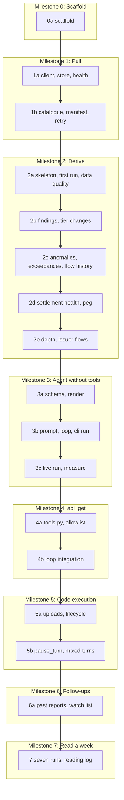

# Build Plan — Blockford Daily Review

**Version:** 0.2 (2026-10-07)
**Status:** pass 0a and milestone 0 done on 2026-10-07. Pass 1a is next and waits on question 14 (which commands need the key). Question 13 asks Jason to rule on the three choices made in pass 0a (T-23 to T-25).

Spec section 12 sets the order: six steps, each ending with a check before the next starts, then a week of reading. Those are the **milestones** here, with their exit checks unchanged. Each milestone is split into **passes** on module boundaries, so that one pass is small enough to write, test, review and commit in one sitting, and no pass touches code another pass owns. Jason ruled this split on 2026-10-07.

No milestone is skipped or merged. No pass starts while a question it depends on is open. Status is kept in the table below and updated in the same change that completes a pass.

## Dependencies

## Status

| Pass | Owns | Blocked by | Status |
|---|---|---|---|
| 0a | `pyproject.toml`, `Makefile`, package skeleton, `config.py`, CLI stubs, fixtures dir | — | done 2026-10-07. Milestone 0 exit check passed on 2026-10-07: `make check` gives lint clean and 53 tests passed; `make help` lists the eight targets; `uv run daily-review --help` lists `run`, `pull-only`, `render` and `--date`; `vendor/API-SPEC.md` line 1 holds the copy header (test in `tests/test_layout.py`). Choices T-23 to T-25 wait on Q13. |
| 1a | `client.py`, `store.py` (pack paths and save), health check | Q14: which commands need the key | not started |
| 1b | `pull.py` catalogue, manifest, failure records, `flow_history` retry | — | not started |
| 2a | `derive.py` skeleton, windows, first run, data quality; fixture conventions | — | not started |
| 2b | Finding comparison, corridor tier changes | — | not started |
| 2c | Anomalies, exceedances, flow history | — | not started |
| 2d | Settlement health, peg | — | not started |
| 2e | Depth, issuer flows | — | not started |
| 3a | `schema.py`, `render.py` | — | not started |
| 3b | `prompts/system.md`, `agent.py` without tools, `cli run`, `cli render` | — | not started |
| 3c | First live run, token and cache measurement | — | not started |
| 4a | `tools.py`: definition, allowlist, caps | size cap value: ask Jason | not started |
| 4b | Loop handles `tool_use`; counts; cross-checks | Q8: confirm `/impact/estimate` before allowlisting | not started |
| 5a | `uploads.py`, upload-then-delete lifecycle in `cli.py` | — | not started |
| 5b | `code_execution` in the loop: `pause_turn`, mixed turns, append-only | — | not started |
| 6a | Past reports and watch list in and out | — | not started |
| 7 | Seven daily runs, reading log, model comparison | — | not started |

## Definition of done

**A pass is done when:**

- `make check` passes: lint, then tests. Tests touch no network and no Claude API (T-21).
- Its "done when" line below holds.
- Documents are updated per the map in [CLAUDE.md](../CLAUDE.md).
- The code review checklist in [ENGINEERING-PRINCIPLES.md](ENGINEERING-PRINCIPLES.md) is run.
- It is committed, once the repository exists.

**A milestone is done when** every pass in it is done and the milestone's exit check from the spec passes against the live API, with the result pasted into the status table row of its last pass.

## Milestone 0 — Scaffold

**Goal:** a repository that runs an empty command and an empty test suite, with the documents and the vendored spec in place.

### Pass 0a — scaffold

Tasks:

1. `git init` and the first commit of the documents, only when Jason says so. Done by Jason before the pass (commit `ba02ce2`).
2. `pyproject.toml` with the package `daily_review`, the `daily-review` console script, dependencies (`anthropic`, `httpx`, `pydantic`, `python-dotenv`), dev dependencies (`pytest`, `ruff`), `requires-python >= 3.11` (T-02).
3. `Makefile` with the eight targets of T-22: `setup`, `test`, `lint`, `check`, `run`, `pull`, `render DATE=YYYY-MM-DD`, `help`. Each one line over `uv`. `help` is the default target and lists the others.
4. `src/daily_review/` with the eleven modules named in [ARCHITECTURE.md](ARCHITECTURE.md) section 3, each empty except a one-line docstring saying its responsibility.
5. `config.py`: the `Settings` type, loading from the environment with `.env` read first, validation that names the missing setting.
6. `cli.py`: `run`, `run --date`, `pull-only`, `render` subcommands that parse and exit 0 without doing anything.
7. `tests/fixtures/README.md` saying fixtures are cut from `vendor/API-SPEC.md` examples and name the section they came from.
8. Confirm the copy header on line 1 of `vendor/API-SPEC.md` is intact.

Tests: missing `ANTHROPIC_API_KEY` fails before any call and names the setting; defaults for `MODEL`, `MAX_TOOL_CALLS`, `MAX_OUTPUT_TOKENS`, `HISTORY_DAYS`; a malformed integer setting fails and names the setting.

**Done when:** `make check` passes (lint, then tests); `make help` lists the eight targets; `uv run daily-review --help` prints the three commands and the `--date` option.

**Milestone 0 exit check:** the same, plus `vendor/API-SPEC.md` present with its copy header.

**Docs:** RUNBOOK (commands confirmed), this file (status).

**Outcome (2026-10-07):** done. Three choices the tasks needed and the spec does not make were recorded as proposals T-23 to T-25 and put to Jason as question 13. Question 14 (which commands need the key) was raised for pass 1a.

## Milestone 1 — Pull

**Goal:** save the data pack. Every endpoint has a file or a failure record.

### Pass 1a — client, store, health

Tasks:

1. `client.py`: one `get(path, params, timeout)` function. Returns a small result value: status, headers, body bytes; or an error value that distinguishes connection refused (reported as "tunnel down", T-18) from timeout from HTTP error. No POST method exists.
2. `store.py`: paths by date (`data/YYYY-MM-DD/raw/`, `failures/`, `manifest.json`, `derived.json`); `save_pack` writes raw bodies byte for byte.
3. `cli.py` `pull-only`: for this pass, the health check only. Reachable: log the body's `status`, `corridorsMonitored`, `updatedAt` (T-19). Connection refused: print "tunnel down", exit 2. HTTP error: print the status, exit 2.

Tests: `FakeClient` by `(path, params)`; the client type has no attribute that sends a non-GET request; health reachable logs the three fields; connection refused exits 2 with "tunnel down" and writes nothing; HTTP 500 exits 2 and writes nothing; `save_pack` round-trips bytes exactly.

**Done when:** `uv run daily-review pull-only` against the tunnel prints the health line and exits 0; with the tunnel closed it prints "tunnel down" and exits 2.

### Pass 1b — catalogue, manifest, retry

Tasks:

1. `pull.py`: the endpoint catalogue as data, one row per spec section 5 line (23 names), each with its path and params. The pull function walks it, calls `client`, and builds the `DataPack`: raw bodies, failure records (`status: null` and `error` starting `tunnel down:` on connection refused), manifest rows with `truncated`, `coverageNotOk`, `totalExceedsRows`, each `null` when the response has no such field.
2. `/flow/history` with `hours=168`, `limit=500`. If the response has `truncated: true`, re-call once with `limit=5000`, save it as `flow_history.retry`, give it its own manifest row (Q3 ruling).
3. `store.py`: save failures and the manifest beside the raw files.
4. `cli.py` `pull-only`: health, pull, save.

Tests: all 23 succeed; one fails with 400 and the others proceed; one times out; one is connection refused mid-run; a body with `truncated: true`; `flow_history` truncated triggers exactly one re-call with `limit=5000` and both bodies are saved; a body with a coverage leg not `ok`; a body where `total` exceeds the rows; fields absent from a response give `null` in the manifest; raw bytes saved equal bytes received.

**Done when:** tests pass; a live `pull-only` writes a file or a failure record for every name.

**Milestone 1 exit check:** against the live API, `data/YYYY-MM-DD/` holds a raw file or a failure record for every one of the 23 names, and `manifest.json` has 23 rows (24 with a retry).

**Docs:** DATA-CONTRACTS section 1 confirmed against real responses; RUNBOOK troubleshooting for pull errors.

## Milestone 2 — Derive

**Goal:** `derived.json` from the pack and the previous run. Each pass cuts the fixtures it needs from `vendor/API-SPEC.md` and adds them under `tests/fixtures/responses/`.

### Pass 2a — skeleton, first run, data quality

Tasks:

1. `derive.py`: the `Derived` shape from [DATA-CONTRACTS.md](DATA-CONTRACTS.md) section 3 as a typed value; `derive(pack, previous)` that fills the window fields (`runDate`, `windowStart`, `windowEnd`, `historyStart`, `previousRunDate`, `firstRun`) and calls one function per statistic, each a stub returning its empty part until its pass lands.
2. The data quality part: `failedCalls`, `truncations`, `coverageFailures`, `partialTotals` from the manifest and failure records.
3. `store.py`: load the most recent earlier `derived.json`; save today's.
4. `cli.py` `pull-only` also derives and saves.
5. Fixture conventions: one file per endpoint example, named as in [TESTING.md](TESTING.md) section 5, each with a comment line naming its spec section.

Tests: first run gives `firstRun: true`, `previousRunDate: null`, empty comparison lists, and the note; a pack with a failure record and a truncation produces the matching data quality rows; `derived.json` is written with sorted keys.

**Done when:** `pull-only` writes a `derived.json` whose data quality section matches the manifest.

### Pass 2b — findings, tier changes

Tasks:

1. Finding comparison: collect `finding.id`, `kind`, `severity` from the four surfaces (`flow_chains`, `bridge_across`, `bridge_cctp`, `confidence`, the five `liquidity_*` files), compare with the previous derived by id equality into `new`, `gone`, `stillOpen`, and `changed` with `field`, `from`, `to` (Q7 ruling). A surface whose file failed is listed in a `surfacesMissing` note, and its previous findings are neither new nor gone.
2. Corridor tier changes: any corridor whose `recommendation` differs from the previous run, with `from`, `to`, `observedAt`.

Tests: same id both runs is `stillOpen`; new id is `new`; missing id is `gone`; a `severity` change appears in `changed`; a failed surface does not produce `gone` entries; a corridor with a changed `recommendation` appears; first run gives empty lists.

**Done when:** tests pass on fixtures cut from the spec's `finding` section and the `/corridors/confidence` example.

### Pass 2c — anomalies, exceedances, flow history

Tasks:

1. Anomalies: `openCount` from `anomalies_open`; `opened` and `resolved` from `anomalies_all` filtered in code by `detectedAt` and `resolvedAt` against the 24-hour window, with the `window` note saying the filtering was done in code (rule 9).
2. Exceedances: count by series for today against the 7-day daily average, with `daysWithData`, from the 168-hour pull. Series the spec declares but that produced no rows stay present with `null` and a `missing` note.
3. Flow history (Q12 ruling, R-DRV-13): per chain from `flow_history` (and `flow_history.retry` when present), the spec's `chains[]` state, the count of rows inside the window that are not `carry_in`, the current status (the newest row's `status`), and when it was set (that row's timestamp), with `carryIn: true` when the current status comes from the carry-in row. Gaps are held status. No `flowRatio` or `netFlowUsd` is carried into the statistic: magnitudes hold only at the transition instant.

Tests: rows outside the window are excluded; a row with `resolvedAt` inside the window counts as resolved even if detected earlier; the window note is set; a declared series with no rows is `null` with a note; the daily average uses only days with data; a chain with only a `carry_in` row has zero transitions and `carryIn: true`; a `carry_in` row is never counted as a transition; a chain in state `unknown_truncated` or `no_history` has `null` counts and a `missing` note; no magnitude field appears in the statistic.

**Done when:** tests pass on fixtures from the `/anomalies`, `/exceedances` and `/flow/history` examples.

### Pass 2d — settlement health, peg

Tasks:

1. Settlement health: per bridge, chain, and asset from `bsh`, today's minimum and median score against the 7-day minimum and median. Stargate, which the spec says is not monitored, appears with `null` and a `missing` note, never as zero.
2. Peg: today's minimum and maximum spread per asset from `spread_history`, with `spread_latest` kept as the `latest` point. Assets the spec says are not polled appear with `null` and the reason.

Tests: medians on an odd and an even number of rows; a group with no rows in the window gives `null` and a note; an unpolled asset is `null` with the reason; no value is ever coerced from `null` to `0`.

**Done when:** tests pass on fixtures from the `/bsh` and `/spread` examples.

### Pass 2e — depth, issuer flows

Tasks:

1. Depth: per asset and band from `depth_latest` and the `liquidity_*` files, today's minimum against the 7-day median, judged against the threshold the response carries, with `thresholdSource` naming the field. Each band is its own entry. No key holds a sum across bands or venues (rule 7). A band with no reading keeps its entry with `null` and the reason.
2. Issuer flows: totals and counts by asset, event type, and flow class from `issuer_flows`. No total above the flow-class level. `unit` is `token` unless the source field is marked USD.

Tests: nested bands are separate entries and the test asserts no value equals the sum of two bands; the threshold comes from the fixture, not from code (a changed fixture threshold changes the judgment); a withheld band is `null` with its reason; issuer flows have no gross total and `unit` is `token` for a non-USD field.

**Done when:** tests pass on fixtures from the `/depth`, `/stablecoins/:asset/liquidity` and `/issuer-flows` examples.

**Milestone 2 exit check:** tests pass on fixtures from the API spec, including the null-is-not-zero and first-run cases. A `derived.json` from a live pack reads sensibly by hand, statistic by statistic.

**Docs:** DATA-CONTRACTS section 3 confirmed; GLOSSARY terms marked *confirm* resolved against the spec.

## Milestone 3 — Agent without tools

**Goal:** stats in, report JSON out, markdown rendered. Schema validates.

### Pass 3a — schema, render

Tasks:

1. `schema.py`: the agent schema (sections 1 to 7) and the report schema (plus `run`) as in [DATA-CONTRACTS.md](DATA-CONTRACTS.md) section 5; the limit check from section 5.2; validation that also enforces: a `hypothesis` has a `confirmation`; enum values for `label`, `kind`, `status`, `scopeKind`.
2. `render.py`: report JSON to markdown per [DATA-CONTRACTS.md](DATA-CONTRACTS.md) section 6, including `Nothing to report.` for empty sections and no currency symbol unless the field name says USD.
3. `tests/fixtures/reports/sample.json` and its golden `sample.md`.

Tests: the limit check passes on the agent schema and fails on a schema with a nullable field, a `minimum`, or 25 optional fields; the sample report validates; a hypothesis without confirmation fails; unknown enum values fail; golden render byte for byte; no "monitor" in the output; every evidence value is printed with its window.

**Done when:** tests pass; `uv run daily-review render tests/fixtures/reports/sample.json` reproduces the golden file.

### Pass 3b — prompt, loop, cli run

Tasks:

1. `prompts/system.md` written from [AGENT-DESIGN.md](AGENT-DESIGN.md) sections 1, 4, 5 and 6.
2. `agent.py`: build the two system blocks (prompt, then the vendored spec with `cache_control`, T-12); build the first user message in the order of AGENT-DESIGN section 2 (date and window, `derived.json`, app findings, past reports oldest first, watch list, closing instruction; `container_upload` blocks come in 5b); call `messages.create` with `output_config.format` and the agent schema, `max_tokens` from settings, no `thinking` parameter (T-13); handle `end_turn`, `max_tokens`, `refusal` (T-08); sum usage across requests. Messages are append-only (T-14).
3. `cli.py` `run`: health, pull, derive, agent, validate, add `run`, render, save. `run --date YYYY-MM-DD` skips the pull and loads that date's pack (T-20). `render` re-renders a saved report. Exit codes per T-09.

Tests: `FakeMessages` with scripted responses; system blocks are byte-identical across two builds in one run and contain no date, run id or model name; `cache_control` is on the last system block only; the first message holds the parts in order; `end_turn` with valid JSON yields a report with summed usage; `refusal` and `max_tokens` exit 3 and leave the pack; `output_config.format` is sent on every request; `run --date` with a saved pack makes no pull call; end-to-end `run` with fakes saves `.json` and `.md` and exits 0.

**Done when:** tests pass; an end-to-end `run` with fakes produces a report that validates.

### Pass 3c — live run, measure

Tasks:

1. One live run on `claude-sonnet-5-5`.
2. Record in [AGENT-DESIGN.md](AGENT-DESIGN.md) section 7: input, output, cache read and cache write tokens; request count; wall time; cost at list price.
3. Read the report by hand. Fix only what blocks the exit check. Write everything else down for milestone 7; the spec says a week of reading comes before prompt changes.

**Done when:** the numbers are in AGENT-DESIGN section 7.

**Milestone 3 exit check:** a live run produces `reports/YYYY-MM-DD.json` that validates and a `.md` beside it. `cache_read_input_tokens` is non-zero on the second request.

**Docs:** AGENT-DESIGN sections 6 to 8 confirmed; RUNBOOK outputs section; README quickstart confirmed.

## Milestone 4 — Add `api_get`

**Goal:** the agent can look closer, within the allowlist and the caps.

### Pass 4a — tools.py, allowlist

Tasks:

1. The tool definition from [AGENT-DESIGN.md](AGENT-DESIGN.md) section 3 (`path`, `query`, `strict: true`, T-06).
2. The allowlist as a static list of GET routes (T-07), with single-segment matching for `:asset`, `:bridge`, `:corridorId`, `:issuer`.
3. The call cap from `MAX_TOOL_CALLS`; the result size cap, whose byte value is put to Jason with a recommendation before this pass starts; the plain-words cut notice.
4. The execute function through `client`: HTTP errors and timeouts as `is_error` results; connection refused as "tunnel down" (T-18); every call logged with path, query, status, bytes, cut or not.

Tests: a test parses `vendor/API-SPEC.md` and asserts the allowlist holds every `GET /api/...` heading, neither `POST` route, and no struck-through route; unknown path rejected as an error result; a POST route path rejected; `:asset` matches one segment and not two; call `MAX_TOOL_CALLS` succeeds and the next returns the cap message; an over-cap result is cut and ends with the notice; connection refused says "tunnel down".

**Done when:** tests pass, including the spec-parsing test.

### Pass 4b — loop integration

Tasks:

1. `agent.py`: on `tool_use`, execute every `api_get` block, return all results in one user message, `is_error` on failures; count calls; the cap message when reached.
2. `run.toolCallsUsed` from the count; cross-check `dataQuality.toolCapReached` against it and log a disagreement.
3. Q8: read `/impact/estimate` in the vendored spec (a GET with `bridge`, `source`, `dest`, `amountUsd`) and confirm with Jason before it is in the allowlist.

Tests: a scripted response with two `api_get` blocks gets both results back in one message with matching ids; the cap message appears in the result after the cap; `toolCallsUsed` equals the number of executed calls; `toolCapReached` disagreement is logged.

**Done when:** tests pass; a live run shows tool calls in the log and in `run.toolCallsUsed`.

**Milestone 4 exit check:** allowlist rejects POST and unknown paths. Cap holds. A live run shows tool calls in the log and in `run.toolCallsUsed`.

**Docs:** AGENT-DESIGN section 3 confirmed with the size cap value; DECISIONS row for the cap value.

## Milestone 5 — Add code execution

**Goal:** the agent reads an uploaded file and computes from it.

### Pass 5a — uploads, lifecycle

Tasks:

1. `uploads.py`: upload each raw file in the pack with `client.files.upload`, return ids in a stable order; delete every id with `client.files.delete`; on a delete failure, log the ids and continue.
2. `cli.py`: upload before the agent; delete after save, and also on agent failure (exit 3 path).

Tests: `FakeFiles`; every raw file uploaded; every id deleted on success and on agent failure; a delete failure is logged with the ids and does not change the exit code.

**Done when:** tests pass; a live `run` leaves no files behind (check with the listing command in RUNBOOK section 7).

### Pass 5b — pause_turn, mixed turns

Tasks:

1. `tools.py`: the `code_execution` tool as one constant, type `code_execution_20260521` (T-03).
2. `agent.py`: add the tool; add `container_upload` blocks to the first message; on `pause_turn`, append the assistant content and re-send with no new user text; on a response holding both a code execution result and an `api_get` call, send a `tool_result` for the `api_get` only; read result blocks by type (`server_tool_use`, `bash_code_execution_tool_result`, `text_editor_code_execution_tool_result`).

Tests: scripted `pause_turn` then `end_turn`; a response with both a `bash_code_execution_tool_result` and an `api_get` `tool_use`; the messages list is append-only across steps (earlier entries unchanged); `container_upload` blocks carry the uploaded ids.

**Done when:** tests pass; a live run shows a code execution block in the response.

**Milestone 5 exit check:** on a live run the agent reads an uploaded file in the sandbox and computes from it, visible in the response blocks and used in a finding's evidence.

**Docs:** ARCHITECTURE section 5 confirmed; RUNBOOK leftover-uploads procedure confirmed.

## Milestone 6 — Follow-ups

**Goal:** day two refers to day one.

### Pass 6a — past reports, watch list

Tasks:

1. `store.py`: list the last `HISTORY_DAYS` reports before today; load and save `state/watchlist.json`.
2. `cli.py`: pass the past reports and watch list to the agent (the message already has their slots from 3b); write the returned `watchList` to `state/watchlist.json` after the report is saved.

Tests: with one past report in a temp dir, the first message contains its findings; the returned watch list overwrites the file with `updatedAt` and `updatedByRun`; ids from the past report appear in `followUps` of a canned response and validate; with no past reports the slots say so.

**Done when:** tests pass.

**Milestone 6 exit check:** run on two consecutive days. Day two's `followUps` names day one's finding ids and the watch list carries forward with status.

**Docs:** DATA-CONTRACTS section 4 confirmed; PRD success criterion 5 ticked.

## Milestone 7 — Read a week of reports

Spec section 12: read a week of reports by hand before changing anything.

1. Run daily for seven days.
2. Keep a reading log in `docs/READING-LOG.md` *(created at this milestone)*: per day, what was right, what was wrong, what was missing, which rule or prompt line it points at.
3. Run the model comparison from [AGENT-DESIGN.md](AGENT-DESIGN.md) section 9 at least once in the week (Q5 ruling).
4. Only after the week: propose changes, with the log as evidence, for Jason's ruling.

**Milestone 7 exit check:** seven reports read, log written, success criteria in [PRD.md](PRD.md) section 6 reviewed one by one.

## Later, not v1

Spec section 12: daily runs inside the VPC, the key in Secrets Manager, email through SES, an S3 archive. Not planned here.
