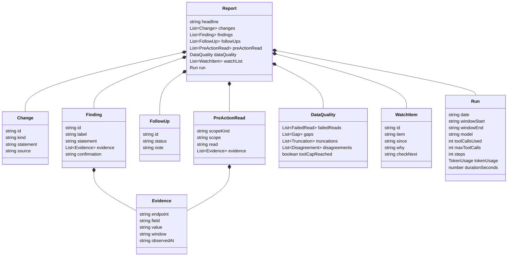

# Data Contracts — Blockford Daily Review

**Version:** 0.1 (2026-10-07)
**Status:** draft. Each shape becomes the contract when the step that builds it ships. Field names in the source API are taken from [BUILD-SPEC.md](BUILD-SPEC.md); the vendored `API-SPEC.md` is the authority on the API side.

Conventions for every shape here:

- Timestamps are ISO 8601 in UTC, with a `Z` suffix.
- Dates are `YYYY-MM-DD`, UTC.
- JSON files are written with sorted keys and two-space indentation, except raw responses, which are written as received.
- A null is kept as `null`. Nothing turns it into `0`, `""`, or `[]`.
- Windows are named on the figure they belong to. No figure stands without its window.

## 1. The data pack

```
data/YYYY-MM-DD/
  raw/<name>.json         # the response body, byte for byte
  failures/<name>.json    # one per failed call
  manifest.json           # one row per endpoint, success or failure
  derived.json            # section 3
```

When `flow_history` came back `truncated: true`, the re-call with `limit=5000` is saved as `raw/flow_history.retry.json` and gets its own manifest row. `<name>` is the Name column of spec section 5: `health`, `flow_chains`, `flow_history`, `bridge_across`, `bridge_cctp`, `bridge_stargate`, `confidence`, `corridors`, `anomalies_open`, `anomalies_all`, `exceedances`, `spread_latest`, `spread_history`, `bsh`, `depth_latest`, `liquidity_USDT`, `liquidity_USDC`, `liquidity_DAI`, `liquidity_PYUSD`, `liquidity_USDe`, `issuer_flows`, `attestations`, `structural_facts`.

### 1.1 Failure record

```json
{
  "name": "flow_history",
  "endpoint": "/flow/history",
  "params": {"hours": 168},
  "at": "2026-10-07T06:00:03Z",
  "status": 400,
  "error": "hours must be between 1 and 168"
}
```

`status` is the HTTP status, or `null` when no response arrived (timeout, connection refused). `error` is the body or the exception message, as text. A connection-refused error is recorded with `error` starting `tunnel down:` (T-18), so the agent and the reader can tell it from an empty response.

### 1.2 Manifest

```json
{
  "runDate": "2026-10-07",
  "windowStart": "2026-10-06T06:00:00Z",
  "windowEnd": "2026-10-07T06:00:00Z",
  "baseUrlHost": "localhost",
  "calls": [
    {
      "name": "corridors",
      "endpoint": "/corridors",
      "params": {"limit": 500},
      "at": "2026-10-07T06:00:04Z",
      "ok": true,
      "status": 200,
      "bytes": 48213,
      "truncated": false,
      "coverageNotOk": [],
      "totalExceedsRows": {"total": 612, "rows": 500}
    }
  ]
}
```

`truncated`, `coverageNotOk`, and `totalExceedsRows` are read from the response where the API provides them. Where the response has no such field the value is `null`, not `false`. `baseUrlHost` records the host only, never the full base URL.

## 2. Previous-run inputs

| Input | Source | When absent |
|---|---|---|
| Previous `derived.json` | the most recent `data/*/derived.json` before today | first run: `previousRunDate` is `null`, `firstRun` is `true` |
| Last 7 reports | `reports/*.json`, the 7 most recent before today | fewer or none: pass what exists |
| Watch list | `state/watchlist.json` | empty list |

## 3. `derived.json`

Computed by `derive.py`. One key per statistic in spec section 6. Every statistic carries its window. Where a source value is null, the derived value is null and `missing` says why.

```json
{
  "runDate": "2026-10-07",
  "windowStart": "2026-10-06T06:00:00Z",
  "windowEnd": "2026-10-07T06:00:00Z",
  "historyStart": "2026-09-30T06:00:00Z",
  "previousRunDate": "2026-10-06",
  "firstRun": false,

  "findings": {
    "surfaces": ["flow_chains", "confidence", "..."],
    "new": [{"id": "...", "surface": "...", "kind": "...", "severity": "..."}],
    "gone": [{"id": "...", "surface": "...", "kind": "...", "severity": "..."}],
    "stillOpen": [{"id": "...", "surface": "...", "kind": "...", "severity": "..."}],
    "changed": [{"id": "...", "field": "severity", "from": "...", "to": "..."}],
    "note": "First run: no previous run to compare with."
  },

  "corridorTierChanges": [
    {"corridor": "...", "from": "...", "to": "...", "observedAt": "..."}
  ],

  "anomalies": {
    "window": "24h, filtered in code by detectedAt and resolvedAt",
    "openCount": 0,
    "opened": [{"id": "...", "detectedAt": "...", "kind": "..."}],
    "resolved": [{"id": "...", "resolvedAt": "...", "kind": "..."}]
  },

  "exceedances": {
    "bySeries": {
      "<series>": {"today": 0, "dailyAverage7d": 0.0, "daysWithData": 7}
    }
  },

  "settlementHealth": {
    "byBridge": {"<bridge>": {"todayMin": null, "todayMedian": null, "weekMin": null, "weekMedian": null, "missing": "no rows in window"}},
    "byChain": {},
    "byAsset": {}
  },

  "depth": {
    "note": "Bands are nested. Each band is its own figure. Never summed.",
    "byAsset": {
      "<asset>": {
        "<band>": {"todayMin": null, "weekMedian": null, "threshold": null, "thresholdSource": "/depth?latest=true field <name>", "missing": null}
      }
    }
  },

  "peg": {
    "byAsset": {"<asset>": {"todayMin": null, "todayMax": null, "missing": null}}
  },

  "flowHistory": {
    "note": "Write-on-change source. A gap is a held status. carry_in rows are window-head state, never transitions. No magnitudes.",
    "byChain": {
      "<chain>": {"state": "transitions_observed", "transitionsInWindow": 0, "currentStatus": "...", "statusSince": "...", "carryIn": false, "missing": null}
    }
  },

  "issuerFlows": {
    "note": "Totals by asset, event type, and flow class. No gross sum.",
    "byAsset": {
      "<asset>": {"<eventType>": {"<flowClass>": {"total": 0, "count": 0, "unit": "token"}}}
    }
  },

  "dataQuality": {
    "failedCalls": [{"name": "...", "endpoint": "...", "status": null, "error": "..."}],
    "truncations": [{"name": "...", "note": "..."}],
    "coverageFailures": [{"name": "...", "leg": "...", "state": "..."}],
    "partialTotals": [{"name": "...", "total": 0, "rows": 0}]
  }
}
```

Rules the shape enforces:

- `firstRun: true` comes with empty `new`, `gone`, `stillOpen`, `changed` lists and a `note`. Nothing is reported as new.
- `depth.byAsset.<asset>.<band>` entries are separate figures. No key holds a sum across bands or venues.
- `issuerFlows` has no total above the `flowClass` level. `unit` is `token` unless the source field is marked USD.
- Every `missing` is a sentence that says what is absent and why, or `null` when nothing is missing.
- `flowHistory.byChain.<chain>.state` is the spec's `chains[]` state verbatim (`transitions_observed`, `unchanged_in_window`, `unknown_truncated`, `no_history`, `excluded_by_filter`). For `unknown_truncated` and `no_history`, `transitionsInWindow` is `null` and `missing` says why. `currentStatus` and `statusSince` come from the newest row; `carryIn` is `true` when that row is the carry-in row. No `flowRatio` or `netFlowUsd` appears here.

The exact field names on the API side (`recommendation`, `detectedAt`, `resolvedAt`, `severity`, `kind`, `truncated`, `coverage`, `total`) are those the spec names. Any other field name is confirmed against the vendored `API-SPEC.md` before it is coded.

## 4. The watch list

`state/watchlist.json`:

```json
{
  "updatedAt": "2026-10-07T06:04:12Z",
  "updatedByRun": "2026-10-07",
  "items": [
    {
      "id": "W-2026-10-05-01",
      "item": "USDC depth at the tightest band on Arbitrum",
      "since": "2026-10-05",
      "why": "Today's minimum sat under the 7-day median for two runs.",
      "checkNext": "Whether tomorrow's minimum is above the API threshold."
    }
  ]
}
```

The agent returns the whole updated list in `watchList`. Code writes it to `state/watchlist.json` after the report is saved. Ids are `W-<date first seen>-<two-digit sequence>` and never change once issued.

## 5. The report

Two schemas in `schema.py`:

- **Agent schema**: sections 1 to 7. This is what the agent produces through structured outputs.
- **Report schema**: the agent schema plus `run`. This is what `reports/YYYY-MM-DD.json` holds and what `render.py` reads.



### 5.1 Field notes

| Section | Field | Notes |
|---|---|---|
| `headline` | — | One sentence or two. The one thing that matters today. On a quiet day, says so. |
| `changes[]` | `kind` | enum: `finding_new`, `finding_gone`, `finding_changed`, `tier_change`, `anomaly_opened`, `anomaly_resolved`, `exceedance_shift`, `settlement_shift`, `depth_shift`, `peg_shift`, `issuer_flow_shift`, `other`. |
| `changes[]` | `source` | A key path into `derived.json`, for example `findings.new[2]` or `depth.byAsset.USDC.<band>`. |
| `findings[]` | `id` | `F-<run date>-<two-digit sequence>`. Stable once issued; later reports refer to it in `followUps`. |
| `findings[]` | `label` | enum: `observed`, `pattern`, `hypothesis`. |
| `findings[]` | `confirmation` | Optional. Required by validation when `label` is `hypothesis`. |
| `evidence[]` | `value` | Always a string, even for numbers. `"null"` when the field was null, and the statement says what is missing. This avoids union types in the schema. |
| `evidence[]` | `window` | The window the value belongs to, in words: `latest`, `1h`, `24h`, `7d`, or the exact start and end. |
| `followUps[]` | `id` | A finding id or watch item id from an earlier report. |
| `followUps[]` | `status` | enum: `resolved`, `still_open`, `dropped`. |
| `preActionRead[]` | `scopeKind` | enum: `chain`, `corridor`, `asset`, `bridge`. |
| `preActionRead[]` | `read` | What the readings mean before acting. Never an instruction to act. |
| `dataQuality` | `failedReads[]` | `{name, endpoint, status, error}`; `status` is a string so that `"none"` can stand for no response. |
| `dataQuality` | `gaps[]` | `{what, why}`. Nulls and missing views. |
| `dataQuality` | `truncations[]` | `{name, note}`. |
| `dataQuality` | `disagreements[]` | `{surface, appFinding, agentView}`. |
| `dataQuality` | `toolCapReached` | Set by the agent from the tool result it received. Code cross-checks it against the count. |
| `watchList[]` | — | The whole updated list. See section 4. |
| `run` | — | Written by code. `tokenUsage` is `{input, output, cacheRead, cacheWrite}` summed over every request in the run. `steps` is the number of Messages API requests. |

### 5.2 Schema limit accounting

Spec section 8 limits, checked by a test in `schema.py`'s test module:

| Limit | Count in the agent schema | Where |
|---|---|---|
| `additionalProperties: false` on every object | all | every object |
| Numeric or string-length constraints | 0 | none used |
| Optional fields, max 24 | 1 | `Finding.confirmation` |
| Union-typed fields, max 16 | 0 | evidence values are strings; nothing is nullable |
| Recursion | none | `Evidence` is referenced through `$defs`, not recursively |

Enums and `$ref` to `$defs` are supported and used.

## 6. Markdown rendering

`render.py` maps the report JSON to `reports/YYYY-MM-DD.md`. One derivation, two formats. The markdown adds nothing the JSON does not hold.

| JSON section | Markdown |
|---|---|
| `run.date`, `run.windowStart`, `run.windowEnd` | Title line: `# Daily Review — YYYY-MM-DD` and a window line |
| `headline` | A paragraph under the title |
| `changes` | `## Changes` as a list; each item `statement` then `source` in a smaller line |
| `findings` | `## Findings`; each as `### id · label` then the statement, an evidence table (endpoint, field, value, window, observed at), and `Confirm by:` when present |
| `followUps` | `## Follow-ups` as a table: id, status, note |
| `preActionRead` | `## Before acting` grouped by `scopeKind`, then `scope`; each `read` with its evidence table |
| `dataQuality` | `## Data quality` with four sub-lists and a line when `toolCapReached` |
| `watchList` | `## Watch list` as a table: id, item, since, why, check next |
| `run` | `## Run` as a small table: model, steps, tool calls used of max, token usage, duration |

Rendering rules: no currency symbol unless the evidence `field` name says USD; windows printed next to every value; empty sections printed with the line `Nothing to report.` so a missing section is visible.
