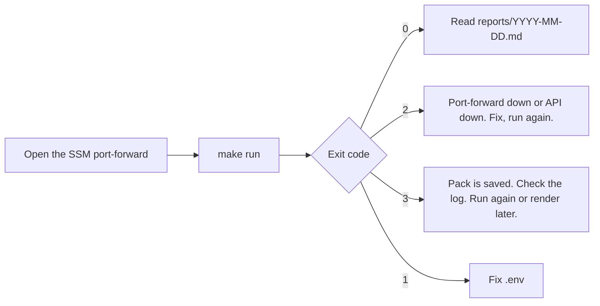

# Runbook — Blockford Daily Review

**Version:** 0.1 (2026-10-07)
**Status:** draft. Commands confirmed in pass 0a on 2026-10-07: every `make` target runs; `run`, `pull-only` and `render` parse and exit 0 without doing anything until their passes land. Port and base path are final (question 2 ruled 2026-10-07). CI added in pass 0b on 2026-10-07 (section 10).

## 1. Before the first run

| Need | Where from |
|---|---|
| Python 3.11 or later and `uv` | `uv` is installed on this machine (0.12.x). `uv sync` built `.venv` on Python 3.11.8 from pyenv; Python 3.12.3 is also present. |
| An Anthropic API key | Put in `.env`. Never committed. |
| The SSM port-forward to the Blockford app | App RUNBOOK section 2b. Local port 3300. See section 1.1 below. |
| `vendor/API-SPEC.md` | In place. Copied 2026-10-07, spec version 1.0, header line says so. |

Setup:

```bash
cp .env.example .env     # fill in ANTHROPIC_API_KEY; BLOCKFORD_API_BASE_URL is pre-filled
make setup               # uv sync
make check               # uv run ruff check src tests, then uv run pytest
```

### 1.1 The tunnel

From the app repo, open the tunnel and leave that shell running:

```bash
export AWS_PROFILE=blockford-admin
cd infra
INSTANCE_ID=$(terraform output -raw instance_id)
aws ssm start-session --target "$INSTANCE_ID" \
  --document-name AWS-StartPortForwardingSession \
  --parameters '{"portNumber":["3000"],"localPortNumber":["3300"]}'
```

Then confirm that prod is what is answering:

```bash
curl -s http://localhost:3300/corridor-scout/api/health | head -c 200
```

Facts about the tunnel that shape the code:

- The local port is **3300**, not 3000. If the local dev stack is running on 3000, a wrong port would quietly read the laptop's data instead of prod.
- Keep the `/corridor-scout` prefix. The app's base path moved `/api/*` too, so a bare `/api/...` returns 404.
- The tunnel closes after a period of inactivity. Calls then get **connection refused**, not an HTTP error. The script reports that as "tunnel down", in the health check, in failure records, and in `api_get` results, so the agent never reads it as "no data".
- Only localhost on the machine running the tunnel can use it. That is why the script, not Claude, makes every call.
- It is the prod database with no edge in front. The only write routes need `ADMIN_SECRET` today, but the tools stay GET-only regardless.

## 2. Settings

All read by `config.py` from the environment, with `.env` loaded first.

| Setting | Meaning | Default |
|---|---|---|
| `ANTHROPIC_API_KEY` | Claude API key. | none, required |
| `BLOCKFORD_API_BASE_URL` | The port-forward address plus `/corridor-scout/api`. | `http://localhost:3300/corridor-scout/api` |
| `MODEL` | The agent's model. | `claude-sonnet-5-5` |
| `MAX_TOOL_CALLS` | `api_get` calls allowed per run. | `15` |
| `MAX_OUTPUT_TOKENS` | `max_tokens` per Messages API response. | `16000` |
| `HISTORY_DAYS` | Days of history pulled and past reports fed in. | `7` |

A missing or malformed setting stops the run before any API call and names the setting. Exit 1. One message names every bad setting at once and never prints a value.

How values are read (T-25, proposed, question 13):

- The real environment wins over `.env`.
- A blank value counts as not set. A blank `ANTHROPIC_API_KEY` is missing; a blank optional setting takes its default.
- `MAX_TOOL_CALLS`, `MAX_OUTPUT_TOKENS` and `HISTORY_DAYS` are whole numbers of 1 or more.
- `BLOCKFORD_API_BASE_URL` starts with `http://` or `https://`.

## 3. Daily routine



1. Open the port-forward (app RUNBOOK section 2b).
2. Run:

   ```bash
   make run                 # uv run daily-review run
   ```

3. Read `reports/YYYY-MM-DD.md`. The JSON beside it is the source.

Other commands, with the `uv` command each target runs:

```bash
make pull                     # uv run daily-review pull-only: save the data pack and derived.json, no agent
make render DATE=YYYY-MM-DD   # uv run daily-review render reports/YYYY-MM-DD.json; without DATE it prints the usage and fails
make help                     # list every target
uv run daily-review run --date YYYY-MM-DD   # reuse that date's saved pack; no pull. No make target; it is the exception, not the routine.
```

## 4. What a run writes

| Path | Content |
|---|---|
| `data/YYYY-MM-DD/raw/<name>.json` | Each response, verbatim |
| `data/YYYY-MM-DD/failures/<name>.json` | One per failed call |
| `data/YYYY-MM-DD/manifest.json` | One row per call with flags |
| `data/YYYY-MM-DD/derived.json` | The computed stats |
| `reports/YYYY-MM-DD.json` | The report, agent sections plus `run` |
| `reports/YYYY-MM-DD.md` | The rendered report |
| `state/watchlist.json` | The updated watch list |

Running twice on one date overwrites that date's files. The previous-run comparison uses the most recent earlier date, not the same date.

## 5. Exit codes

| Code | Meaning | What to do |
|---|---|---|
| 0 | Report written. Endpoint failures, if any, are in the data quality section. | Read the report. |
| 1 | Bad or missing setting, or a usage error: unknown command, missing argument, or a `--date` that is not a real `YYYY-MM-DD` date (T-23, proposed). | Fix `.env`, or the command line. The message names the problem. |
| 2 | `/health` unreachable. Nothing written. | Check the port-forward and the app. Run again. |
| 3 | Claude call failed, refused, hit `max_tokens`, or the JSON did not validate. Data pack kept. | Read the log. Run again. The pack for the date is already saved, so `run --date YYYY-MM-DD` reuses it without pulling again. |

## 6. Troubleshooting

| Symptom | Likely cause | Check |
|---|---|---|
| Exit 2 at once, "tunnel down" | Tunnel not open or closed from inactivity, or wrong port in `BLOCKFORD_API_BASE_URL` | Reopen the tunnel (section 1.1); `curl` the health path by hand |
| Failure records or `api_get` results saying "tunnel down" mid-run | The tunnel closed during the run | Reopen it and run again |
| `flow_history` failure record with 400 | `hours` or `limit` not an integer in range (`hours` 1 to 720, `limit` 1 to 5000) | The catalogue value in `pull.py`; the 400 body states the range |
| Many failure records with the same HTTP status | App restarted mid-run | Run again |
| Exit 3 with a schema error | The model's JSON did not validate, or `max_tokens` was hit | The log shows the stop reason and the validation message. If `max_tokens`, raise `MAX_OUTPUT_TOKENS`. |
| Exit 3 with `refusal` | The model declined | Read the `stop_details` category in the log. Tell Jason. No automatic fallback in v1 (T-08). |
| `toolCapReached` true in the report | The agent used all `MAX_TOOL_CALLS` | Read what it was looking for. Raising the cap is Jason's ruling. |
| `cacheRead` is zero in `run.tokenUsage` | Something volatile crept into the system prompt or tools | The agent test for byte-stable system blocks; diff two requests' rendered prompts |
| Delete warning at the end of the run | Files API delete failed | The log lists the file ids. Delete them by hand (section 7). |
| 401 from the Claude API | Bad key | `.env` |
| `warning: VIRTUAL_ENV=... does not match the project environment path .venv` on every `uv` command | A pyenv or other virtualenv is active in the shell. `uv` ignores it and uses the project's `.venv`. | Harmless. To silence it, `unset VIRTUAL_ENV` in that shell. |

## 7. Leftover uploaded files

Uploads are deleted at the end of every run. If a run died before that, list and delete by hand:

```bash
uv run python -c "import anthropic; c=anthropic.Anthropic(); [print(f.id, f.filename) for f in c.files.list()]"
uv run python -c "import anthropic, sys; anthropic.Anthropic().files.delete(sys.argv[1])" file_xxx
```

## 8. Cost

Measured in build step 3 and recorded in [AGENT-DESIGN.md](AGENT-DESIGN.md) section 7. The `run.tokenUsage` section of every report shows input, output, cache read, and cache write tokens for that run. The code execution sandbox has a monthly free allowance; one run a day stays inside it.

## 9. Logs

The run logs to stderr: the health body's `status`, `corridorsMonitored` and `updatedAt` first, so the log shows which deployment answered; each API call with path, status, bytes; each Messages API request with stop reason and usage; each tool call with path, query, status, bytes, cut or not; each upload and delete. No log line contains the API key or a request body.

## 10. CI

GitHub Actions runs `.github/workflows/check.yml` on every push and every pull request, on any branch. It is the same gate as on Jason's machine, so a change that passes `make check` locally passes here too.

What runs, in order, on `ubuntu-latest` with Python 3.11 (the floor, Q15):

1. Check out the commit, with no saved credentials.
2. Install `uv` (`astral-sh/setup-uv@v7`), with its cache on.
3. `uv sync --locked`. Fails if `uv.lock` is out of step with `pyproject.toml`.
4. `make check`: ruff, then pytest.

The workflow has `contents: read` only and is given no secrets. No step can reach the Claude API with a key or the Blockford API, which only localhost can reach. The test suite cuts off the network as well (TESTING section 1).

Reading a red check:

| Red step | Cause | Fix |
|---|---|---|
| `uv sync --locked` | `pyproject.toml` changed without `uv.lock` | `uv lock` locally (or `uv add`, which writes both), then commit `uv.lock` |
| `Lint, then test`, ruff output | A lint error, or a function over complexity 10 | `make lint` locally; split the function rather than raising the limit |
| `Lint, then test`, a test fails | A behaviour broke | `make test` locally; the test name says the requirement |
| A test fails with `tests never touch the network (T-21)` | A test reached a socket instead of a fake | Give the test the fake for that I/O module (TESTING section 3) |
| `test_this_checkout_tracks_nothing_it_should_not` | A file under `data/`, `reports/` or `state/`, an `.env` file, or an image in `docs/` was committed | `git rm --cached <path>`, and commit. If it was `.env`, rotate the key: it is in the history. |

Branch protection on `main`, so the check must pass before a merge, is set by Jason in the GitHub repository settings (Settings, Branches). It is not held in the repo. Pass 0b task 6 tracks it.
