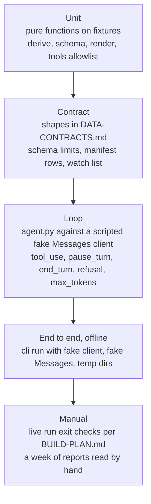

# Testing — Blockford Daily Review

**Version:** 0.2 (2026-10-07)

[ENGINEERING-PRINCIPLES.md](ENGINEERING-PRINCIPLES.md): write tests first when possible, every change needs regression tests, never refactor without tests. This document says how that applies here.

## 1. Rules

1. Tests never touch the network. No call reaches the Blockford API or the Claude API from a test. This is enforced, not trusted: an autouse fixture in `tests/conftest.py` makes every socket `connect`, `connect_ex` and `getaddrinfo` raise `RuntimeError` with the words `tests never touch the network (T-21)` (Q16). It is a `RuntimeError` and not a connection error, so a client test that expects "tunnel down" can never pass on a real refused connection. There is no way to switch it off for one test.
2. Every I/O module has a fake: `client.py` (HTTP), `store.py` (filesystem, use a temp dir), `uploads.py` (Files API), and the Messages API inside `agent.py`.
3. Fixtures are response samples taken from `vendor/API-SPEC.md`. Each fixture file names the spec section it came from.
4. Pure modules (`derive.py`, `schema.py`, `render.py`) are tested with values in, values out. No mocks.
5. A test states the requirement it covers in its name or docstring, using the ids from [PRD.md](PRD.md).
6. A bug found in a live report gets a test before it gets a fix.
7. Repository rules are tests too (Q17): `tests/test_repo_rules.py` reads `git ls-files` and fails if a tracked file is an `.env` file other than `.env.example`, sits under the top-level `data/`, `reports/` or `state/`, or is an image under `docs/`. It skips with a reason outside a git checkout. It reads the index, so a staged file is caught before the commit.
8. `make check` runs on GitHub Actions on every push and pull request ([RUNBOOK.md](RUNBOOK.md) section 10).

## 2. Levels



The first four run in `make test`. The fifth is the exit check of each milestone and milestone 7.

## 3. Fakes

| Fake | Replaces | Behavior |
|---|---|---|
| `FakeClient` (`tests/fakes.py`) | `client.get` | A dict from `(path, params)` to a canned client result: a `Response`, or a failure value (`HttpError`, `TunnelDown`, `Timeout`, `Unreachable`). Records every call with its timeout. Has no POST method, like the real one. Tests of `client.py` itself use httpx's `MockTransport`, so no socket is opened. |
| `FakeMessages` | `client.messages.create` | A scripted list of responses returned in order. Each is a real SDK response type built from a dict, so block types and `stop_reason` are read the same way as in production. Records every request so tests can assert on `messages`, `tools`, `system`, `output_config`. |
| `FakeFiles` | `client.files.upload` and `delete` | Returns ids; records uploads and deletes. Can fail delete on demand. |
| temp dirs | `data/`, `reports/`, `state/` | `tmp_path` from pytest, passed to `store.py` as its root directory (T-28). |

## 4. Required cases

Grouped by module. Each line is a test or a small group of tests.

### `config.py`

- Settings load without `ANTHROPIC_API_KEY` (Q14). `require_api_key`, which `run` calls first, fails on a missing key and names the setting (R-CFG-2). A blank key counts as missing.
- Defaults: `MODEL`, `MAX_TOOL_CALLS`, `MAX_OUTPUT_TOKENS`, `HISTORY_DAYS` (R-CFG-1).
- A malformed integer setting (not a whole number, or below 1) fails and names the setting; every bad setting is named in one error (R-CFG-2, T-25).
- A base URL without `http://` or `https://`, without a host, with a port that is not 1 to 65535, or that cannot be parsed fails and names the setting, without echoing the value; the settings error is one line (T-25).
- `.env` is read; the real environment wins over it; a blank environment value does not hide a `.env` value; a missing `.env` is not an error (T-25).
- The key never appears when `Settings` is printed (ARCHITECTURE section 7).

### `pull.py` and `client.py`

- Every endpoint in the catalogue is called once with the spec's parameters (R-PULL-1).
- Raw bytes saved equal bytes received, including whitespace (R-PULL-2).
- One endpoint fails with 400: failure record with status and error; the other calls proceed (R-PULL-3).
- Timeout: failure record with `status: null` (R-PULL-3).
- Connection refused: failure record with `status: null` and `error` starting `tunnel down:` (T-18).
- `truncated`, coverage not `ok`, `total` over rows: each recorded in the manifest (R-PULL-4).
- `flow_history` with `truncated: true`: exactly one re-call with `limit=5000`; both bodies saved; the manifest records both (R-PULL-6).
- Fields absent from a response yield `null` in the manifest, not `false` (R-PULL-4).
- The client has no way to send a non-GET request: `get` is its only public method (R-PULL-5, D-03).
- The client keeps a 2xx body byte for byte; a non-2xx is an `HttpError` with status and body; a 3xx is not followed; the timeout defaults to 30 s and can be set per call (T-26).
- The faked connection errors are built the way httpx 0.28 and httpcore 1.0 really chain them: the OS error only in a suppressed `__context__`. A test checks that shape, so a client that stops following `__context__` fails.
- A body that does not decode by its `Content-Encoding` is `Unreachable`, not a raised error; an error body is cut to 300 characters; an empty one gives `HTTP <status>` (T-26).
- Connection refused and connection reset are `TunnelDown` naming host and port; a timeout is `Timeout`; a failed name lookup is `Unreachable` and never says "tunnel down" (T-18, T-26).
- Health (`pull.check_health`): one GET of `/health`; the spec example gives the three T-19 fields; `degraded` and `down` still count as reachable; an absent field shows as `missing` and a null as `null`; a 200 body that is not a JSON object is `NotJson`; a failed call is passed through (T-27).
- Health unreachable: nothing written, exit 2, message says "tunnel down" on connection refused (R-RUN-4, T-18).
- `store.py`: pack paths by date; `save_pack` round-trips bytes exactly; a second save on one date overwrites; a name that is not a plain file name is refused (R-PULL-2, T-28).

### `derive.py`

- Each statistic on a normal fixture (R-DRV-1 to R-DRV-9).
- First run: `firstRun: true`, empty comparison lists, a note; nothing reported as new (R-DRV-10).
- Null source value: derived value is `null`, `missing` is a sentence (R-DRV-11).
- Depth: no key holds a sum across bands or venues; thresholds come from the response (R-DRV-6, R-DRV-12).
- Issuer flows: no total above flow class; unit is `token` unless the field is USD (R-DRV-8).
- Anomalies: rows outside the window by `detectedAt` or `resolvedAt` are excluded and the window note is set (R-PULL-7).
- Flow history (R-DRV-13): a gap is a held status, not an interpolated value (rule 10); a `carry_in` row sets the window-head state and is never counted as a transition; a chain in state `unknown_truncated` or `no_history` has `null` counts and a `missing` note; no magnitude field appears in the statistic.
- A finding whose `severity` changed appears in `changed` with `from` and `to` (R-DRV-1).
- A corridor whose `recommendation` changed appears in `corridorTierChanges` (R-DRV-2).

### `schema.py`

- The agent schema passes the limit check: every object has `additionalProperties: false`; no numeric or string-length constraints; optional fields at most 24; union-typed fields at most 16; no recursion (R-RPT-2).
- A hand-written full report validates (R-RPT-3, R-RPT-4).
- A `hypothesis` without `confirmation` fails validation (rule 3).
- Unknown `label`, `kind`, `status`, or `scopeKind` values fail.

### `render.py`

- Golden test: a sample report renders to a checked-in markdown file, byte for byte (R-RPT-5).
- No currency symbol appears next to a value whose field name does not say USD (rule 6).
- The word "monitor" does not appear in the output (rule 13).
- Every evidence value is printed with its window (rule 8).
- An empty section prints `Nothing to report.` (R-FAIL-5).

### `tools.py`

- The allowlist holds every GET route in the vendored spec, parsed from the file in the test (R-AGT-5).
- Neither POST route is in the allowlist; a request for one is rejected (D-03).
- A route the spec marks removed (struck through, such as `/flight`) is not in the allowlist.
- An unknown path is rejected with an error result, not an exception.
- A path with a `{asset}` parameter matches one segment and not two.
- The call cap holds: call `MAX_TOOL_CALLS` succeeds, the next returns the cap message (R-FAIL-4).
- A result over the size cap is cut and ends with the plain-words notice.
- HTTP errors and timeouts return `is_error` results.
- Connection refused returns an `is_error` result whose text says "tunnel down" and does not say "no data" (T-18).

### `agent.py`

- System blocks are byte-identical across two builds in one run; no date, run id, or model name in them (R-AGT-9).
- `cache_control` is on the last system block and nowhere volatile.
- The first message contains, in order: date and window, `derived.json`, app findings, past reports oldest first, watch list, `container_upload` blocks, closing instruction (R-AGT-3, R-AGT-4).
- `end_turn` with valid JSON yields a report and summed usage.
- `tool_use` with two `api_get` blocks: both executed, both results in one user message, ids match.
- `pause_turn`: assistant content appended, request re-sent with no new user text (R-AGT-7).
- A response with a code execution result and an `api_get` call: only the `api_get` gets a `tool_result` (R-AGT-7).
- Messages are append-only across steps: earlier entries are unchanged.
- `refusal` and `max_tokens`: raise a failure that `cli.py` maps to exit 3; the pack is untouched (R-FAIL-3, R-FAIL-6).
- `output_config.format` is sent with the agent schema on every request (R-RPT-1).

### Layout

- Each of the eleven modules in [ARCHITECTURE.md](ARCHITECTURE.md) section 3 imports and states its responsibility in a one-line docstring.
- `vendor/API-SPEC.md` keeps its copy header on line 1 (milestone 0 exit check).

### Network guard and repository rules

- The socket guard makes `connect` and `connect_ex` to localhost, `create_connection`, a name lookup, and an `httpx.get` raise; the error is not an `OSError` (T-21, Q16).
- The repository rule function passes a clean file list and accepts `.env.example`.
- It reports, with its rule, each of `.env`, `.env.local`, a nested `.env`, `data/2026-10-07/raw/health.json`, `reports/2026-10-07.json` and `.md`, `state/watchlist.json`, `docs/diagram.png`, an upper-case `.SVG` under `docs/`.
- A `reports` or `state` name below the top level is not a breach.
- This checkout tracks nothing it should not (hard constraint 13).

### `uploads.py`

- Every raw file is uploaded; ids returned in a stable order.
- Every id is deleted at the end, on success and on agent failure.
- A delete failure is logged with the ids and does not change the exit code.

### `cli.py`

- `run`, `run --date YYYY-MM-DD`, `pull-only` and `render <path>` parse; `--help` lists the three commands and `--date` (R-RUN-6, R-RUN-7).
- A bad `--date`, an unknown command, or a missing argument exits 1, not 2 (T-23).
- `run` end to end with fakes: report `.json` and `.md` saved, watch list written, uploads deleted, exit 0 (R-RUN-3, R-RUN-5).
- Logging (T-28): with a bare root logger, as in a real run, the health line reaches stderr as `<UTC time> INFO health: ...` and stdout stays empty; a bad setting is one timestamped line; no `httpx` record reaches the log. `caplog` alone cannot show this, since it captures records whatever the handlers are. The tunnel hint appears on "tunnel down" only.
- `pull-only` in pass 1a: health reachable logs the three fields and exits 0; it needs no key (Q14); connection refused exits 2 with "tunnel down" and writes nothing; an HTTP 500, a timeout, an unreachable host and a non-JSON body each exit 2 and write nothing; a bad setting exits 1 before any call (R-RUN-4, R-RUN-8, T-09).
- `pull-only` writes the pack and `derived.json`, calls no Messages API (R-RUN-6). From pass 2a.
- `run --date` with a saved pack makes no pull call and proceeds from the pack (R-RUN-7).
- The health body's `status`, `corridorsMonitored` and `updatedAt` appear in the log (R-RUN-8).
- `render` re-renders a saved report to the same markdown as the golden file.
- Exit codes match the table in [ARCHITECTURE.md](ARCHITECTURE.md) section 10.

## 5. Fixtures

```
tests/fixtures/
  README.md                # where each file came from
  responses/<name>.json    # one per endpoint name, from API-SPEC.md examples
  responses/<name>.variant.<case>.json   # truncated, null, coverage cases
  reports/sample.json      # a full report that validates
  reports/sample.md        # its golden rendering
  derived/first-run.json
  derived/day-two.json
```

Fixtures hold no real depth figures beyond what the API spec itself shows.

## 6. Commands

```bash
make check                    # lint, then every test: the gate before every commit
make test                     # uv run pytest
make lint                     # uv run ruff check src tests
uv run pytest tests/test_derive.py -k null   # one area, straight through uv
```

## 7. Manual checks

The exit check of each step in [BUILD-PLAN.md](BUILD-PLAN.md) is run against the live API through the port-forward and the real Claude API. The result is pasted into the step's status row. Step 7 reads a week of reports and keeps the reading log.
